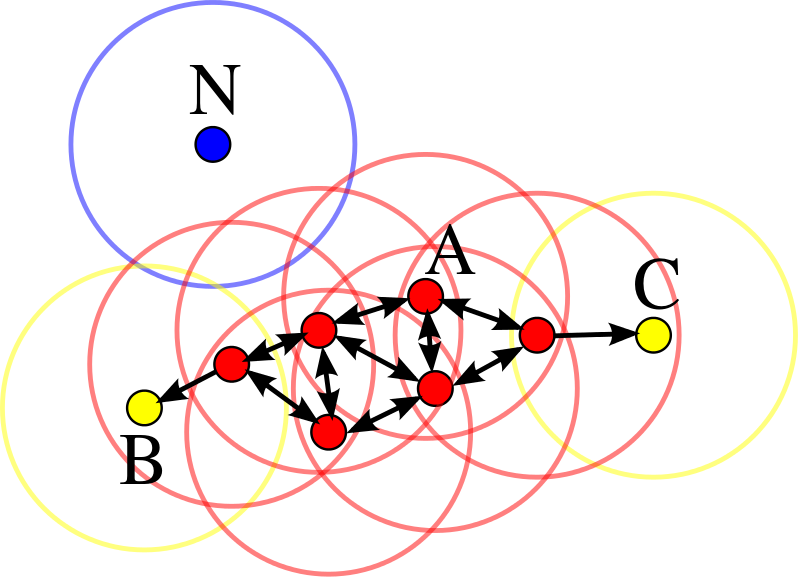

### what is DBSCAN ?
DBSCAN stands for Density-based spatial clustering of applications with noise, it's a density-based clustering algorithm. It groups together points in high-density regions, and marks points in low-density regions as outliers. DBSCAN is one of the most common clustering algorithms and also most cited in scientific literature.

### how does DBSCAN work?
dbscan is an algorithm with parameters of $( \epsilon , MinPts )$.
Before we describe how dbscan works, there are some terms we need to know at first.
 * core point. core point is the point that has at least $MinPts $ points are within the distance $\epsilon$. 
 * directly reachable. directly reachable point is the one which is within distance $\epsilon$ from a core point.
 * reachable. reachable point is the one that can be connected to a core point by a path, and each point on the path is directly reachable to the neighbor point.
 * not reachable. a point that is not reachable to any other point, it's an outlier.
 * density-connected. two points $p$ and $q$ are density-connected when there exists a point such that both $p$ and $q$ are reachable to the point.

In the above picture, the $MinPts$ is 4, all red points such as A are core points because each point has 4 points around(including itself) within the distance of $\epsilon$ which is the radius of the red circle. B and C are not core points, but they are reachable to A. N is not reachable.  
so, let's take a step back, what kind of points can be clustered as a cluster: any point is reachable from any other point of the cluster.
All points in the cluster are mutaully density-connected.

### References
https://en.wikipedia.org/wiki/DBSCAN