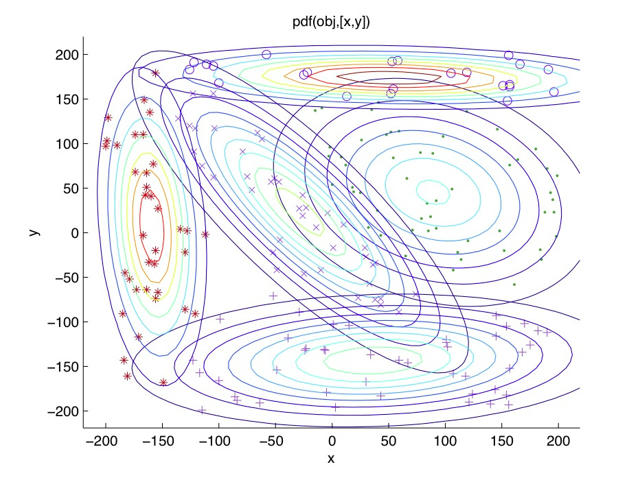

### What is gaussian mixture model ?
Gaussian mixture models are a probabilistic model for representing normally distributed subpopulations within an overall population.  

The model is parameterized by two types of values:
 * the mixture component weights
 * the component means and variances.
For a Gaussian mixture model with $K$ components. 

$$
\begin{aligned} p ( x ) & = \sum _ { i = 1 } ^ { K } \phi _ { i } \mathcal { N } ( x | \mu _ { i } , \sigma _ { i } ) \\ \mathcal { N } ( x | \mu _ { i } , \sigma _ { i } ) & = \frac { 1 } { \sigma _ { i } \sqrt { 2 \pi } } \exp \left( - \frac { \left( x - \mu _ { i } \right) ^ { 2 } } { 2 \sigma _ { i } ^ { 2 } } \right) \\ \sum _ { i = 1 } ^ { K } \phi _ { i } & = 1 \end{aligned}
$$
where $\mu_{i}$ and $\sigma_{i}$ is the mean and variance to the $k^{th}$ components, and $\phi_{i}$ is the correspoing component weight. from the last equation we get the total probability distribution normalizes to 1.

### clustering with Gaussian mixture models
we assume that the data points are gaussian distributed, each gaussian distribution is assigned to a single cluster.

we often use Expectation-Maximization(EM) to find the parameters of the Gaussian model for each cluster.

### References
https://people.csail.mit.edu/rameshvs/content/gmm-em.pdf  
https://brilliant.org/wiki/gaussian-mixture-model/