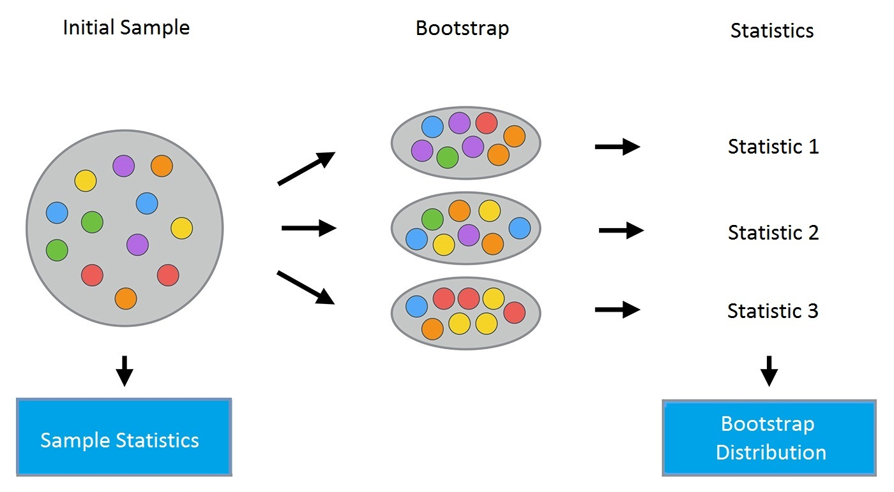
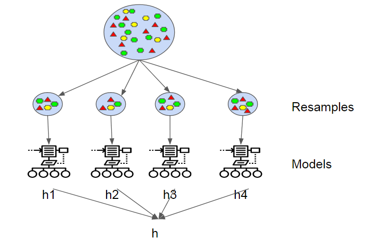

### what is Bagging?
bagging was propsed by Leo Breiman in 1994, also called **Bootstrap aggregating**, is a machine learning ensemble meta-algorithm designed to improve the stability and accuracy of machine learning. It help to avoid overfitting by reducing variance. It's usually applied to decision tree methods.

### how does bagging work?
There are also two steps of bagging working process:

 * generating training sets. generate $m$ new training sets $D _ { i }$ by sampling from orginal training set $D$ uniformly and with replacement. If each new trainig size is equal to the original training set size $n$ and if $n$ is large, the $D _ {i}$ has the fraction  $( 1 - 1 / e ) ( \approx 63.2 \% )$ of the unique examples of $D$.

 * training. train each new training set, generating the corresponding model. then use **voting for classification** or **averaging for regression** to select the model.

### References
https://medium.com/open-machine-learning-course/open-machine-learning-course-topic-5-ensembles-of-algorithms-and-random-forest-8e05246cbba7  
https://en.wikipedia.org/wiki/Bootstrap_aggregating 
https://medium.com/open-machine-learning-course/open-machine-learning-course-topic-5-ensembles-of-algorithms-and-random-forest-8e05246cbba7 
