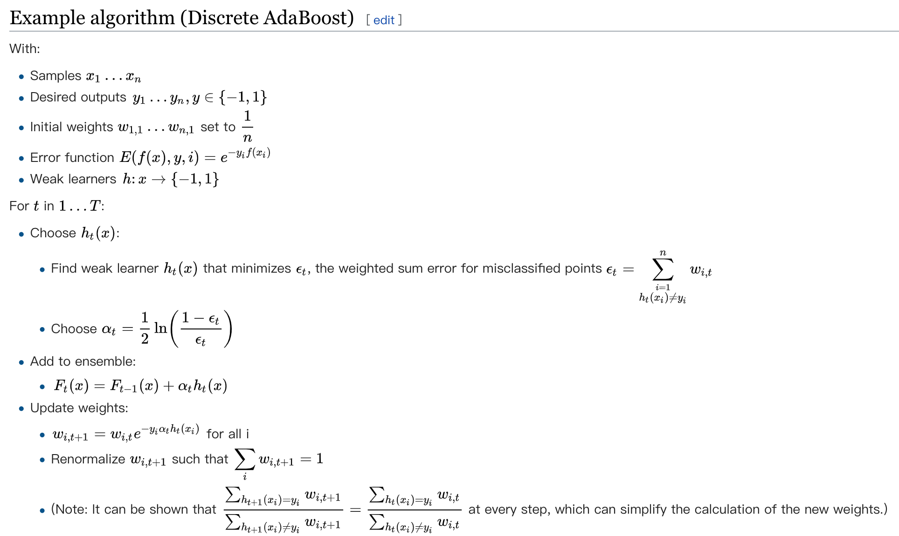

### What is AdaBoost?
AdaBoost, short for **Adaptive Boosting**, is a machine-learning meta-algorithm formulated by 2003 Gödel Prize winner Yoav Freund and Robert Schapire. It combines some other learning algorithms (weak learners) with weighted sum into the boosted classifier to improve performance. It's often written with the following:

$$
F ( x ) = \operatorname { sign } \left( \sum _ { m = 1 } ^ { M } \theta _ { m } f _ { m } ( x ) \right)
$$
where $f _ { m } ( x )$ stands for the $m$th weak learner and $\theta_m$ is the corresponding weight.

### How does AdaBoost work?

In short, AdaBoost processing includes:
 * retrain the algorithm iterativel by the training set transformed according to the accuracy of previous training
 * the weight of each weak classifier depends on the current accuracy.

Among all those equations above, the two important are: 
$$
w _ { i , t + 1 } = w _ { i , t } e ^ { - y _ { i } \alpha _ { t } h _ { t } \left( x _ { i } \right) }
$$
for step 1
and
$$
\alpha _ { t } = \frac { 1 } { 2 } \ln \left( \frac { 1 - \epsilon _ { t } } { \epsilon _ { t } } \right)
$$
for step 2.

### Prons and Cons
#### Prons
 * reduce bias and variance

#### Cons
 * sensitive to noisy data and outliers
 * likely to overfit
 * for sequential classifiers

### References
https://medium.com/machine-learning-101/https-medium-com-savanpatel-chapter-6-adaboost-classifier-b945f330af06  
https://en.wikipedia.org/wiki/AdaBoost