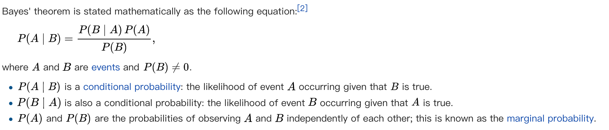

### The Naive Bayes Algorithm

$$
P \left( Y = c _ { k } | X = x \right) = \frac { P \left( Y = c _ { k } \right) \prod _ { j } P \left( X ^ { ( j ) } = x ^ { ( j ) } | Y = c _ { k } \right) } { \sum _ { k } P \left( Y = c _ { k } \right) \prod _ { j } P \left( X ^ { ( j ) } = x ^ { ( j ) } | Y = c _ { k } \right) }
$$
Note: the features of input are independent to each other.<br>
The algorithm is based on the Bayes Theorem. 


### The Naive Bayes Classifier
A Naive Bayes Classifier use the algorithm to predict a output class value according to a set of set of attributes.
```
For loop [each know class value] {
    step 1. calculate probabilities of each attribute under the condition of class value.
    step 2. get the joint conditional probability of all the attributes of the input.
    step 3. calculate the conditional probabilities of the class value.
}
The class with the highest conditional probability wins.
```
