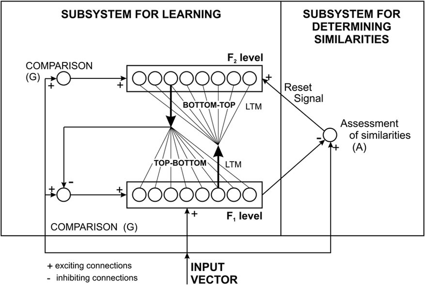

### What is ART network?
ART network stands for **Adaptive resonance theory** network, it was developed by Stenphen Grossberg and Gail Carpenter with focus on cognitive science and with repect to neural system. It offers a solution to the 'plasticity/stability' problem, i.e. the problem of acquiring new knowledge without disrupting existing knowledge that is also called **incremental learning**.

### How it works?
The basic ART network is a kind of competitive learning, thus it's a unsupervised learning model. It typically consist of **a comparison field**, **a recognition field** composed of neurons, **a vigilance parameter(threshold of recognition)**, and **a reset module**. Its processing steps list as follows:
 * the comparison field takes an input vector, then transfers it to its best match in the recofnition field. The best match is the single neuron whose weight vector most closed matches the input vector.
 * each recognition field inhibits each of the other recognition field by outputting a negative signal which is proportional to the matching quality above. the matching recognition field is the classifying result for the input vector. it's the winner.
 * the reset module compares the strength of the matching to the vigilance parameter. If the matching wins the vigilance parameter, the weights of the winning recognition neuron are adjusted towards the features of the input vector. Otherwise, A search procedure is carried out, in which the reset function will disable the recognition neurons one by one until the vigilance parameter is overcome. If no recognition neuron wins, an uncommitted neuron is committed with its weight adjusted towards matching the input vector.

### Code
[cbirkj github](https://github.com/cbirkj/art-python/blob/master/art/train.py) is a good explanation of ART network.

### Type
 * ART1
 * ART2
 * ARTMAP
 * Fuzzy ART

### References
[wikipedia](https://en.wikipedia.org/wiki/Adaptive_resonance_theory)

