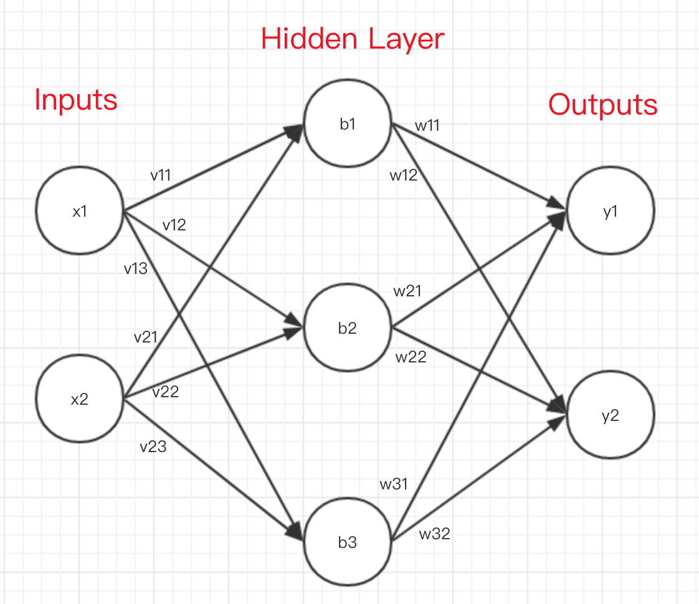

### What is backpropagation?
*Wikipedia* says, **Backpropagation** is a method used in artificial neural networks to calculate a gradient that is needed in the calculation of the weights to be used in the network, it's shorthand for "the backward propagation of error".

### Code
back_propagation.py

### Reference
https://medium.freecodecamp.org/build-a-flexible-neural-network-with-backpropagation-in-python-acffeb7846d0