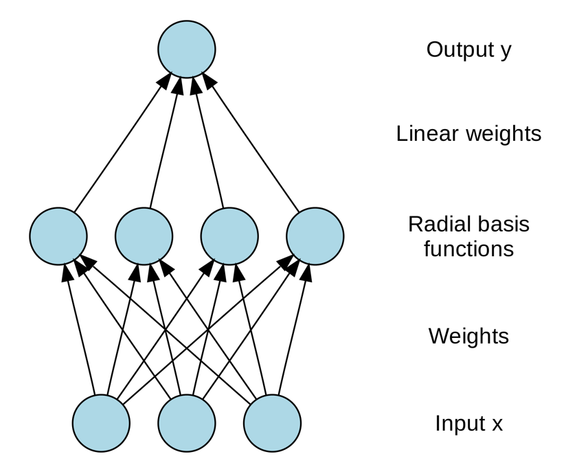

### TODO
code implementation

### RBF Network
RBF stands for Radial Basis Function, and RBF network is an artificial neural network. It's output is linear combination of radial basis functions of the inputs and neuron parameters.


RBF network (usually has one hidden layer) can be written by following:<br>

```math
\varphi ( \boldsymbol { x } ) = \sum _ { i = 1 } ^ { N } w _ { i } \rho \left( \boldsymbol { x } , \boldsymbol { c } _ { i } \right)
```

```math
\rho \left( \boldsymbol { x } , \boldsymbol { c } _ { i } \right) = e ^ { - \beta _ { i } \left\| \boldsymbol { x } - \boldsymbol { c } _ { i } \right\| ^ { 2 } }
```
In above equations, `$N$` is the number of neurons in the hidden layer, `$\boldsymbol {c}_{i}$` is the center vector for neuron `$i$` and `$w_{i}$` is the weight of neuron `$i$` for the ourput neuron. So the function only depends on the distance from center vector, so the function is radially symmetric about the vector, that's why the function is called radial basis function.


### References
http://mccormickml.com/2013/08/15/radial-basis-function-network-rbfn-tutorial/  <br>
https://github.com/oarriaga/RBF-Network/blob/master/RBFN.py <br>
